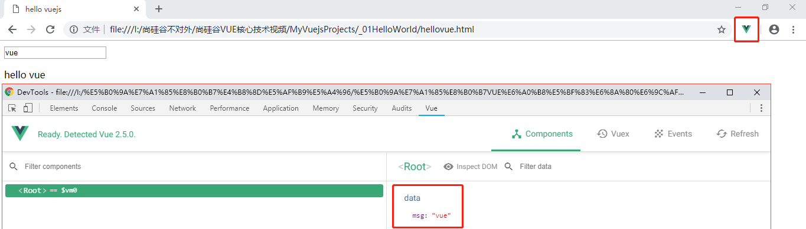

# Vue.js 入门

[TOC]

## 一、Vue.js 简介

> Vue.js（以下简称 vue）是一款渐进式 JavaScript 框架，由华裔软件工程师`尤雨溪`开发，用于动态构建用户界面。

### 1、Vue 特点

1. 遵循 MVVM 模式
2. 编码简洁，体积小，运行效率高，适合移动 / PC 端开发
3. 本身只关注 UI，可以轻松引入 vue 插件或其他第三方库开发项目

### 2、与其他前端 js 框架比较

1. 借鉴 angular 的 `模板 `和`数据绑定`技术
2. 借鉴 react 的`组件化`和`虚拟 DOM` 技术

### 3、vue 扩展插件

1. vue-cli: vue 脚手架
2. vue-resource(axios): ajax 请求
3. vue-router: 路由
4. vuex: 状态管理
5. vue-layload: 图片懒加载
6. vue-scroll: 页面滑动相关
7. mint-ui: 基于 vue 的 移动端 UI 组件库
8. element-ui: 基于 vue 的 PC 端 UI 组件库

## 二、Vue 入门实例

### 1、MVVM 模式

```javascript
<!DOCTYPE html>
<html>
<head>
  <title>hello vuejs</title>
  <script type="text/javascript" src="../js/vue.js"></script>
</head>
<body>

<!-- View -->
<div id="app">
  <input type="text" v-model="msg"><br>
  <p>hello {{msg}}</p><!--大括号表达式-->
</div>

<script type="text/javascript">
  // 创建的 Vue 实例就是 VM (ViewModel)
  const vm = new Vue({
    el: '#app', // element 选择器
    data: { // 数据，即 Model
      msg: 'vue'
    }
  })
</script>

</body>
</html>
```

### 2、Vue Devtools 插件

Vue Devtools 是一款 Chrome crx 插件，安装后效果如图



### 3、MVVM 实现过程

Model 是数据模型，存储于内存，View 是视图，即 DOM，而 ViewModel（Vue 实例对象）通过 DOM Listener （监听器）实现 DOM 事件监听，将内存中的Data Binding （数据绑定）到 DOM 上。

 

## 三、模板语法

### 表达式与指令

```javascript
<!--模板-->
<div id="app">
  <input type="text" v-model="msg"><br><!--指令-->
  <p>hello {{msg}}</p><!--大括号表达式-->
  <p>hello {{msg.toUpperCase()}}</p><!--大括号表达式-->

  <p>{{ msg2 }}</p><!-- textContent -->
  <p v-text="msg2"></p><!-- textContent -->
  <p v-html="msg2"></p><!-- innerHTML -->

  <!-- 指令一：强制数据绑定 -->
  
  

  <!-- 指令二：绑定事件监听 -->
  <button v-on:click="testHehe">hehe</button>
  <button @click="testHehe2(msg)">hehe</button>

</div>

<script type="text/javascript">
  const vm = new Vue({
    el: '#app',
    data: {
      msg: 'vue',
      msg2: '<a href="#">点我干嘛</a>',
      imgUrl: 'https://cn.vuejs.org/images/logo.png'
    },
    methods: {
      testHehe: function () { alert('呵呵') },
      testHehe2(msg) { alert(msg) }
    }
  })
</script>
```

## 四、计算属性 & 监视

```javascript
<!--
1. 计算属性
  在computed属性对象中定义计算属性的方法
  在页面中使用{{方法名}}来显示计算的结果
2. 监视属性:
  通过通过vm对象的$watch()或watch配置来监视指定的属性
  当属性变化时, 回调函数自动调用, 在函数内部进行计算
3. 计算属性高级:
  通过getter/setter实现对属性数据的显示和监视
  计算属性存在缓存, 多次读取只执行一次getter计算
-->
<div id="demo">
  姓: <input type="text" placeholder="First Name" v-model="firstName"><br>
  名: <input type="text" placeholder="Last Name"  v-model="lastName"><br>
  <!--fullName1是根据fistName和lastName计算产生-->
  姓名1(单向): <input type="text" placeholder="Full Name1" v-model="fullName"><br>
  姓名2(单向): <input type="text" placeholder="Full Name2" v-model="fullName2"><br>
  姓名3(双向): <input type="text" placeholder="Full Name3" v-model="fullName3"><br>
  <p>{{fullName}}</p>
  <p>{{fullName}}</p>
  <p>{{fullName}}</p>
</div>
<script type="text/javascript" src="../js/vue.js"></script>
<script type="text/javascript">
  const vm = new Vue({
    el: '#demo',
    data: {
      firstName: 'A',
      lastName: 'B',
      fullName2: 'A B'
    },
    computed: {
      fullName() {
        // 计算属性方法的返回值作为属性
        return this.firstName + ' ' + this.lastName
      },
      fullName3: {
        // 计算并返回当前属性的值
        get() {
          return this.firstName + ' ' + this.lastName
        },
        set(value) {
          const names = value.split(' ');
          this.firstName = names[0];
          this.lastName = names[1];
        }
      }
    },
    // 配置监视
    watch: {
      // fistName 发生了变化
      firstName: function (newVal, oldVal) { 
        console.log(this);
        this.fullName2 = newVal + ' ' + this.lastName;
      }
    }
  })
  vm.$watch('lastName', function (value) {
    this.fullName2 = this.firstName + ' ' + value;
  })
</script>
```

## 五、条件渲染

```javascript
<!--
1. 条件渲染指令
  v-if
  v-else
  v-show
2. 比较v-if与v-show
  如果需要频繁切换 v-show 较好
-->
<div id="demo">
  <p v-if="ok">表白成功</p>
  <p v-else>表白失败</p>
  <hr>
  <p v-show="ok">求婚成功</p>
  <p v-show="!ok">求婚失败</p>
  <button @click="ok=!ok">切换</button>
</div>
<script type="text/javascript" src="../js/vue.js"></script>
<script type="text/javascript">
  new Vue({
    el: '#demo',
    data: {
      ok: true,
    }
  })
</script>
```

## 六、列表渲染

```javascript
<!--
1. 列表显示
  数组: v-for / index
  对象: v-for / key
2. 列表的更新显示
  删除item
  替换item
-->
<div id="demo">
  <h2>测试: v-for 遍历数组</h2>
  <ul>
    <li v-for="(p, index) in persons" :key="index">
      {{ p.name }} -> {{ p.age }} -> {{ index }}
      --> <button @click="deleteP(index)">删除</button>
      <button @click="updateP(index, { name: 'Cat', age: 20 })">更新</button>
    </li>
  </ul>
  <h2>测试: v-for 遍历对象</h2>
  <ul>
    <li v-for="(value, key) in persons[1]" :key="key">{{ key }} --> {{ value }}</li>
  </ul>
</div>
<script type="text/javascript" src="../js/vue.js"></script>
<script type="text/javascript">
  new Vue({
    el: '#demo',
    data: {
      persons: [ // vue 本身只是监视了 persons 对象的改变，没有监视数组内部数据的改变
        {name: 'Tom', age:18},
        {name: 'Jack', age:17},
        {name: 'Bob', age:19},
        {name: 'Mary', age:16}
      ]
    },
    methods: {
      deleteP(index) {
        this.persons.splice(index, 1)
      },
      updateP(index, newP) {
        // this.persons[index] = newP; // 并没有改变 person 本身
        // this.persons = [];
        this.persons.splice(index, 1, newP);
        // splice 可以实现增删改
      }
    }
  })
</script>
```

## 七、事件处理

```javascript
<!--
1. 绑定监听:
  v-on:xxx="fun"
  @xxx="fun"
  @xxx="fun(参数)"
  默认事件形参: event
  隐含属性对象: $event
2. 事件修饰符:
  .prevent : 阻止事件的默认行为 event.preventDefault()
  .stop : 停止事件冒泡 event.stopPropagation()
3. 按键修饰符
  .keycode : 操作的是某个keycode值的健
  .enter : 操作的是enter键
-->
<div id="example">
  <h2>1. 绑定监听</h2>
  <button @click="test1">test1</button>
  <button @click="test2('test2')">test2</button>
  <button @click="test3(123, $event)">test3</button>

  <h2>2. 事件修饰符</h2>
  <div style="width: 200px; height: 200px; background-color: red;"
      @click="testParent">
    <div style="width: 100px; height: 100px; background-color: blue;"
        @click.stop="testChild"></div>
  </div>
  <a href="http://www.baidu.com"
      @click.prevent="testBaidu">百度</a>
  <h2>3. 按键修饰符</h2>
  <input type="text" name=""
      @keyup.enter="testText" />
</div>
<script type="text/javascript" src="../js/vue.js"></script>
<script type="text/javascript">
  new Vue({
    el: '#example',
    data: {

    },
    methods: {
      test1() {
        alert('test1');
      },
      test2(msg) {
        alert(msg);
      },
      test3(number, event) {
        alert(number + '-->' + event.target.innerHTML);
      },
      testParent() {
        alert('parent');
      },
      testChild(event) {
        // 原生 js 阻止事件冒泡
        // event.stopPropagation();
        alert('child');
      },
      testBaidu(event) {
        // 原生 js 阻止事件默认行为
        // event.preventDefault();
        alert('点击了');
      },
      testText(event) {
        // enter 13 响应
        /*if (event.keyCode === 13) {
          alert(event.target.value + ' ' + event.keyCode);
        }*/
        alert(event.target.value)
      }
    }
  })
</script>
```

## 八、表单数据绑定

```javascript
<!--
1. 使用v-model(双向数据绑定)自动收集数据
  text/textarea
  checkbox
  radio
  select
-->
<div id="demo">
  <form action="/xxx" @submit.prevent="handleSubmit">
    <span>用户名: </span>
    <input type="text" v-model="username"><br>
    <span>密码: </span>
    <input type="password" v-model="pwd"><br>
    <span>性别: </span>
    <input type="radio" id="female" value="女" v-model="sex">
    <label for="female">女</label>
    <input type="radio" id="male" value="男" v-model="sex">
    <label for="male">男</label><br>
    <span>爱好: </span>
    <input type="checkbox" id="basket" value="basket" v-model="likes">
    <label for="basket">篮球</label>
    <input type="checkbox" id="foot" value="foot" v-model="likes">
    <label for="foot">足球</label>
    <input type="checkbox" id="pingpang" value="pingpang" v-model="likes">
    <label for="pingpang">乒乓</label><br>
    <span>城市: </span>
    <select v-model="cityId">
      <option value="">未选择</option>
      <option :value="city.id" v-for="(city, index) in allCitys" :key="city.id">{{city.name}}</option>
    </select><br>
    <span>介绍: </span>
    <textarea rows="10" v-model="info"></textarea><br><br>

    <input type="submit" value="注册">
  </form>
</div>
<script type="text/javascript" src="../js/vue.js"></script>
<script type="text/javascript">
  new Vue({
    el: '#demo',
    data: {
      username: '',
      pwd: '',
      sex: '女',
      likes: [],
      allCitys: [
        { id: 1, name: 'BJ' },
        { id: 2, name: 'SH' },
        { id: 3, name: 'SZ' }
      ],
      cityId: '',
      info: '你啊你好呀'
    },
    methods: {
      handleSubmit() {
        console.log(this.username, this.pwd, this.sex,
          this.likes, this.cityId, this.info);
      }
    }
  })
</script>
```

## 九、生命周期


```javascript
<!--
1. vue对象的生命周期
  1). 初始化显示
    * beforeCreate()
    * created()
    * beforeMount()
    * mounted()
  2). 更新状态
    * beforeUpdate()
    * updated()
  3). 销毁vue实例: vm.$destory()
    * beforeDestroy()
    * destroyed()
2. 常用的生命周期方法
  created()/mounted(): 发送ajax请求, 启动定时器等异步任务
  beforeDestroy(): 做收尾工作, 如: 清除定时器
-->
<div id="test">
  <button @click="destroyVue">destory vue</button>
  <p v-if="isShow">尚硅谷IT教育</p>
</div>
<script type="text/javascript" src="../js/vue.js"></script>
<script type="text/javascript">
  new Vue({
    el: '#test',
    data: {
      isShow: true
    },
    beforeCreate() {
      console.log('beforeCreate');
    },
    created() {
      console.log('created');
    },
    beforeMount() {
      console.log('beforeMount');
    },
    // 初始化显示之后立即调用
    mounted() {
      this.intervalId = setInterval(() => { 
        console.log('-----');
        this.isShow = !this.isShow; 
      }, 1000)
    },
    beforeUpdate() {
      console.log('beforeUpdate');
    },
    updated() {
      console.log('updated');
    },
    beforeDestroy() {
      // 清除定时器
      clearInterval(this.intervalId);
    },
    destroyed() {
      console.log('destroyed');
    },
    methods: {
      destroyVue() {
        // 销毁 vm 实例
        this.$destroy();
      }
    }
  })
</script>
```

## 十、过渡 & 动画

````javascript
  <style>
    .bounce-enter-active {
      animation: bounce-in .5s;
    } 
    .bounce-leave-active {
      animation: bounce-in .5s reverse;
    }
    @keyframes bounce-in {
      0% {
        transform: scale(0);
      }
      50% {
        transform: scale(1.5);
      }
      100% {
        transform: scale(1);
      }
    }
  </style>
</head>
<body>
<div id="example-2">
  <button @click="show = !show">Toggle show</button>
  <br>
  <transition name="bounce">
    <p v-if="show" style="display: inline-block">Lorem</p>
  </transition>
</div>
<script type="text/javascript" src="../js/vue.js"></script>
<script>
  new Vue({
    el: '#example-2',
    data: {
      show: true
    }
  })
</script>
````

## 十一、过滤器

```javascript
<!--
1. 理解过滤器
  功能: 对要显示的数据进行特定格式化后再显示
  注意: 并没有改变原本的数据, 可是产生新的对应的数据
2. 编码
  1). 定义过滤器
    Vue.filter(filterName, function(value[,arg1,arg2,...]){
      // 进行一定的数据处理
      return newValue
    })
  2). 使用过滤器
    <div>{{myData | filterName}}</div>
    <div>{{myData | filterName(arg)}}</div>
-->
<!--需求: 对当前时间进行指定格式显示-->
<div id="test">
  <h2>显示格式化的日期时间</h2>
  <p>{{time}}</p>
  <p>最完整的: {{time | dateString2}}</p>
  <p>年月日: {{time | dateString2('YYYY-MM-DD')}}</p>
</div>
<script type="text/javascript" src="../js/vue.js"></script>
<script type="text/javascript" src="https://cdn.bootcss.com/moment.js/2.22.1/moment.js"></script>
<script>
  // 定义过滤器
  Vue.filter('dateString', function (value, format='YYYY-MM-DD HH:mm:ss') {
    return moment(value).format(format);
  })
  // 格式化日期写法二
  Vue.filter('dateString2', function (value, format) {
    return moment(value).format(format || 'YYYY-MM-DD HH:mm:ss');
  })
  new Vue({
    el: '#test',
    data: {
      time: new Date()
    },
    
  })
</script>
```

## 十二、内置指令 & 自定义指令

```javascript
<!--
常用内置指令
  v:text : 更新元素的 textContent
  v-html : 更新元素的 innerHTML
  v-if : 如果为true, 当前标签才会输出到页面
  v-else: 如果为false, 当前标签才会输出到页面
  v-show : 通过控制display样式来控制显示/隐藏
  v-for : 遍历数组/对象
  v-on : 绑定事件监听, 一般简写为@
  v-bind : 强制绑定解析表达式, 可以省略v-bind
  v-model : 双向数据绑定
  ref : 为某个元素注册一个唯一标识, vue对象通过$refs属性访问这个元素对象
  v-cloak : 使用它防止闪现表达式, 与css配合: [v-cloak] { display: none }
-->
<div id="example">
  <p ref="content">Hello Vue.js</p>
  <button @click="tips">点我</button>
  <p v-cloak>{{ msg }}</p>
</div>
<script type="text/javascript" src="../js/vue.js"></script>
<script type="text/javascript">
  alert('hello')
  new Vue({
    el: '#example',
    data: {
      msg: '你好'
    },
    methods: {
      tips() {
        alert(this.$refs.content.innerHTML)
      }
    }
  })
</script>
```

```javascript
<!--
1. 注册全局指令
  Vue.directive('my-directive', function(el, binding){
    el.innerHTML = binding.value.toupperCase()
  })
2. 注册局部指令
  directives : {
    'my-directive' : {
        bind (el, binding) {
          el.innerHTML = binding.value.toupperCase()
        }
    }
  }
3. 使用指令
  v-my-directive='xxx'
-->
<!--
需求: 自定义2个指令
  1. 功能类型于v-text, 但转换为全大写
  2. 功能类型于v-text, 但转换为全小写
-->
<div id="test">
  <p v-upper-text="msg"></p>
  <p v-lower-text="msg"></p>
</div>
<div id="test2">
  <p v-upper-text="msg"></p>
  <p v-lower-text="msg"></p>
</div>
<script type="text/javascript" src="../js/vue.js"></script>
<script type="text/javascript">
  // 注册一个全局指令
  // el: 指令所在的标签对象
  // binding: 包含指令相关数据的容器对象
  Vue.directive('upper-text', function (el, binding) {
    console.log(el, binding)
    el.textContent = binding.value.toUpperCase()
  })
  new Vue({
    el: '#test',
    data: {
      msg: "I Like You"
    },
    // 注册局部指令
    directives: {
      'lower-text'(el, binding) {
        console.log(el, binding)
        el.textContent = binding.value.toLowerCase()
      }
    }
  })
  new Vue({
    el: '#test2',
    data: {
      msg: "I Like You Too"
    }
  })
</script>
```

## 十三、插件

```javascript
/**
 * 自定义 Vue 插件库
 * @param  {[type]} window [description]
 * @return {[type]}        [description]
 */
(function (window) {
  // 需要向外暴露的插件对象
  const MyPlugin = {}
  // 插件必须有一个 install()
  MyPlugin.install = function (Vue, options) {
    // 1. 添加全局方法或属性
    Vue.myGlobalMethod = function () {
      console.log('Vue函数对象的myGlobalMethod()')
    }

    // 2. 添加全局资源
    Vue.directive('my-directive', function (el, binding) {
      el.textContent = 'my-directive----' + binding.value
    })

    // 4. 添加实例方法
    Vue.prototype.$myMethod = function () {
      console.log('vm $myMethod()')
    }
  }
  // 向外暴露
  window.MyPlugin = MyPlugin
})(window)
```

```javascript
<div id="test">
  <p v-my-directive="msg"></p>
</div>

<script type="text/javascript" src="../js/vue.js"></script>
<script type="text/javascript" src="vue-myPlugin.js"></script>
<script type="text/javascript">
  // 声明使用插件(安装插件: 调用插件的install())
  Vue.use(MyPlugin) // 内部会调用插件对象的install()

  const vm = new Vue({
    el: '#test',
    data: {
      msg: 'HaHa'
    }
  })
  Vue.myGlobalMethod()
  vm.$myMethod()

  new Object()
</script>
```

## 十四、本文 Demo

[占位符]()

## 十五、参考文献

- [尚硅谷 Vue 视频](http://www.atguigu.com)